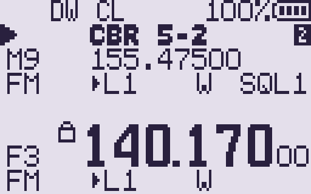
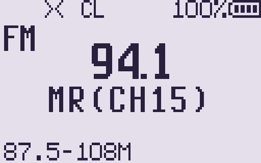
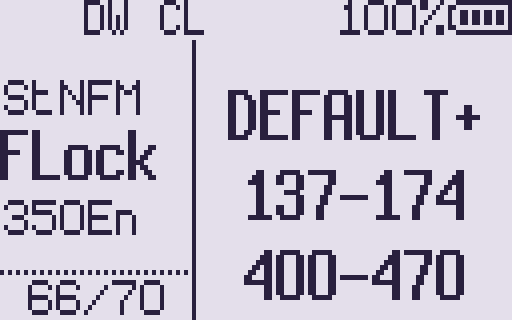
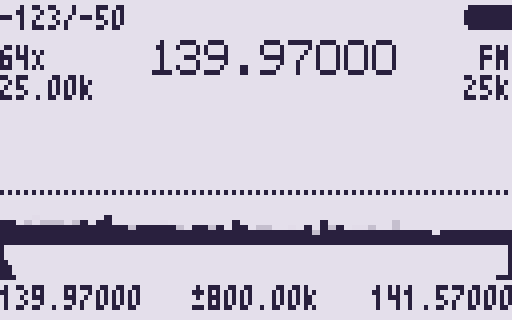
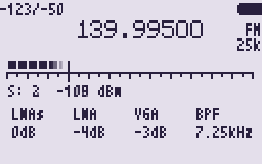
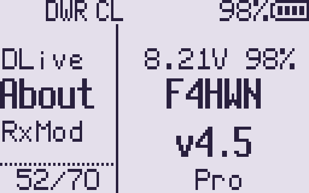

# Open re-implementation of the Quansheng UV-K5/K6/5R v2.1.27 firmware

This repository is a fork of the [Original F4HWN firmware](https://github.com/armel/uv-k5-firmware-custom), which itself builds upon the [Egzumer custom firmware](https://github.com/egzumer/uv-k5-firmware-custom) (a merge of [OneOfEleven's custom firmware](https://github.com/OneOfEleven/uv-k5-firmware-custom) and [fagci's spectrum analyzer](https://github.com/fagci/uv-k5-firmware-fagci-mod)), plus a few of my own changes and bugfixes.

All is a cloned and customized version of DualTachyon's open firmware found [here](https://github.com/DualTachyon/uv-k5-firmware) ... a cool achievement !

> [!NOTE]
> About Chirp, as many others firmwares, you need to use a dedicated driver available in [this repository](https://github.com/nicodotgit/uv-k5-firmware-custom/blob/main/uvk5_egz_f4hwn_ndg_ver_4_4_2.py).

> [!WARNING]
> THIS FIRMWARE HAS NO REAL BRAIN. PLEASE USE YOUR OWN. Use this firmware at your own risk (entirely). There is absolutely no guarantee that it will work in any way shape or form on your radio(s), it may even brick your radio(s), in which case, you'd need to buy another radio.
Anyway, have fun.

> [!CAUTION]
> I recommend to backup your eeprom with [k5prog](https://github.com/sq5bpf/k5prog) before playing with alternative firmwares. It's a good reflex to have.

<p align="center">
  
  
  
  
  
  
</p>

## Table of Contents

* [Firmware Variants](#firmware-variants)
* [Fork Changes](#custom-changes-on-this-fork)
* [F4HWN Features](#main-features-and-improvements-from-f4hwn)
* [Egzumer Features](#main-features-from-egzumer)
* [Manual](#manual)
* [Radio Performance](#radio-performance)
* [Compiler](#compiler)
* [Building](#building)
* [Credits](#credits)
* [Other sources of information](#other-sources-of-information)
* [Original F4HWN Donators](#donators-from-original-f4hwn)
* [License](#license)

## Firmware Variants

Several firmware versions are available, each tailored to a specific use case because of the strict 60KB hardware memory limit:

| Edition | Build Size & Space | Key Features |
|---------|--------------------|--------------|
| 🧰 **[Pro (Custom)](https://armel.github.io/uvtools/?firmwareURL=https://github.com/nicodotgit/uv-k5-firmware-custom/raw/main/archive/latest/f4hwn.pro.packed.bin)** | **Size:** 61,440 bytes<br>**Free:** 0 bytes | ✅ FM Broadcast<br>✅ Bandscope<br>✅ K5 Viewer<br>🚫 VOX / Air Copy<br>✅ All other features enabled |
| 📺 **[Bandscope edition](https://armel.github.io/uvtools/?firmwareURL=https://github.com/nicodotgit/uv-k5-firmware-custom/raw/main/archive/latest/f4hwn.bandscope.packed.bin)** | **Size:** 60,800 bytes<br>**Free:** 640 bytes | ✅ Bandscope<br>🚫 FM Broadcast<br>🚫 VOX<br>✅ Air Copy<br>✅ K5 Viewer<br>✅ All other features enabled |
| 📻 **[Broadcast edition](https://armel.github.io/uvtools/?firmwareURL=https://github.com/nicodotgit/uv-k5-firmware-custom/raw/main/archive/latest/f4hwn.broadcast.packed.bin)** | **Size:** 59,048 bytes<br>**Free:** 2,392 bytes | ✅ FM Broadcast<br>🚫 Bandscope<br>✅ VOX<br>✅ Air Copy<br>✅ K5 Viewer<br>✅ All other features enabled |
| 🚨 **[RescueOps edition](https://armel.github.io/uvtools/?firmwareURL=https://github.com/nicodotgit/uv-k5-firmware-custom/raw/main/archive/latest/f4hwn.rescueops.packed.bin)** | **Size:** 56,712 bytes<br>**Free:** 4,728 bytes | ✅ First responder oriented<br>🚫 FM Broadcast<br>🚫 Bandscope<br>✅ VOX<br>✅ Air Copy<br>✅ K5 Viewer<br>✅ NOAA weather<br>✅ All other features enabled |
| ☘️ **[Basic edition](https://armel.github.io/uvtools/?firmwareURL=https://github.com/nicodotgit/uv-k5-firmware-custom/raw/main/archive/latest/f4hwn.basic.packed.bin)** | **Size:** 60,832 bytes<br>**Free:** 608 bytes | ✅ FM Broadcast<br>✅ Bandscope *(simplified)*<br>🚫 VOX<br>🚫 Air Copy<br>🚫 K5 Viewer<br><br>*Some features had to be disabled because of limited available memory...*<br><br>🚫 Audio Bar<br>🚫 CTR/Contrast Menu<br>🚫 Resume State<br>🚫 Charging C |
| 🎮 **[Game edition](https://armel.github.io/uvtools/?firmwareURL=https://github.com/nicodotgit/uv-k5-firmware-custom/raw/main/archive/latest/f4hwn.game.packed.bin)** | **Size:** 60,136 bytes<br>**Free:** 1,304 bytes | ✅ Built-in Breakout-style game<br>✅ FM Broadcast<br>🚫 Bandscope<br>🚫 VOX<br>✅ Air Copy<br>🚫 K5 Viewer<br>✅ All other features enabled |

## Custom changes on this fork

* **Repository Cleanup:** Removed unneeded precompiled archives and images, and pruned unused GitHub actions workflows.
* **Memory & Performance Optimizations:** Replaced the external `printf` library with a minimalist custom formatter to aggressively save flash space. Converted primitives to `#define` macros, replaced `MENU_GetLimits` with a packed static look-up table, abbreviated labels, and conditionally stripped unused fonts and menu strings.
* **Firmware & Security Fixes:** Enforced TX lock across global frequencies to prevent F-Lock bypass vulnerabilities. Added bounds checking on the FSK buffer, corrected 108MHz bounds checks, and resolved compander display bugs on disabled scanlist channels.
* **UI & Display Enhancements:** Added animated charging text, optimized display refresh logic, and added a perfectly centered small font fallback for FM radio and AirCopy. Tweaked ST7565 inverse display command and renamed menu entries.
* **Custom Build (`Pro` edition):** Added a streamlined build target that enables Spectrum Analyzer, FM Radio, custom menu layout, K5 Viewer, and AM fix, but strictly removes Vox, Aircopy, NOAA, Rescue Ops, Games, PMR/GMRS, Alarms, and DTMF Calling to fit the 60KB limit.
* **Code Quality & Build System:** Removed extensive dead code and commented-out blocks. Optimized compiler flags, improved the linker script, and updated the CHIRP driver to fit as an internal custom module.

## Main features and improvements from F4HWN:

* improve default power settings level: 
    * Low1 to Low5 (<~20mW, ~125mW, ~250mW, ~500mW, ~1W), 
    * Mid ~2W, 
    * High ~5W,
    * User (see SetPwr),
* improve S-Meter (IARU Region 1 Technical Recommendation R.1 for VHF/UHF - [read more](https://hamwaves.com/decibel/en/)),
   * S-Meter (S0/S9) Level EEPROM settings that were introduced in the Egzumer firmware are now ignored and replaced by hardcoded values to comply with the IARU Recommendation.     
* improve bandscope (Spectrum Analyser):
    * add channel name,
    * add save of some spectrum parameters,
* improve UI: 
    * menu index is always visible, even if a menu is selected,
    * s-meter new design (Classic or Tiny), 
    * MAIN ONLY screen mode, 
    * DUAL and CROSS screen mode, 
    * RX blink on VFO RX, 
    * RX LED blink, 
    * Squelch level and Monitor,
    * Step value,
    * CTCSS or DCS value,
    * KeyLock message,
    * last RX,
    * move BatTxt menu from 34/63 to 30/63 (just after BatSave menu 29/63),
    * rename BackLt to BLTime,
    * rename BltTRX to BLTxRx,
    * improve memory channel input,
    * improve keyboard frequency input,
    * add percent and gauge to Air Copy,
    * improve audio bar,
    * and more...
* new menu entries and changes:
    * add SetPwr menu to set User power (<20mW, 125mW, 250mW, 500mW, 1W, 2W or 5W),
    * add SetPTT menu to set PTT mode (Classic or OnePush),
    * add SetTOT menu to set TOT alert (Off, Sound, Visual, All),
    * add SetCtr menu to set contrast (0 to 15),
    * add SetInv menu to set screen in invert mode (Off or On),
    * add SetEOT menu to set EOT (End Of Transmission) alert (Off, Sound, Visual, All),
    * add SetMet menu to set s-meter style (Classic or Tiny),
    * add SetLck menu to set what is locked (Keys or Keys + PTT),
    * add SetGUI menu to set font size on the VFO baseline (Classic or Tiny),
    * add TXLock menu to open TX on channel,
    * add SetTmr menu to set RX and TX timers (Off or On),
    * add SetOff menu to set the delay before the transceiver goes into deep sleep (Off or 1 minute to 2 hours),
    * add SetNFM menu to set Narrow width (12.5kHz or 6.25kHz),
    * rename BatVol menu (52/63) to SysInf, which displays the firmware version in addition to the battery status,
    * improve PonMsg menu,
    * improve BackLt menu,
    * improve TxTOut menu,
    * improve ScnRev menu (CARRIER from 250ms to 20s, STOP, TIMEOUT from 5s to 2m)
    * improve KeyLck menu (OFF, delay from 15s to 10m)
    * add HAM CA F Lock band (for Canadian zone),
    * add PMR 446 F Lock band,
    * add FRS/GMRS/MURS F Lock band,
    * remove blink and SOS functionality, 
    * remove AM Fix menu (AM Fix is ENABLED by default),
    * add support of 3500mAh battery,
* improve status bar:
    * add SetPtt mode in status bar,
    * change font and bitmaps,
    * move USB icon to left of battery information,
    * add RX and TX timers,
* improve lists and scan lists options:
    * add new list 3,
    * add new list 0 (channel without list...),
    * add new scan lists options,
        * scan list 0 (all channels without list),
        * scan list 1,
        * scan list 2,
        * scan list 3,
        * scan lists [1, 2, 3],
        * scan all (all channels with or without list),
    * add scan list shortcuts,
* add resume mode on startup (scan, bandscope and broadcast FM),
* new actions:
    * RX MODE,
    * MAIN ONLY,
    * PTT, 
    * WIDE NARROW,
    * 1750Hz,
    * MUTE,
    * POWER HIGH (RescueOps),
    * REMOVE OFFSET (RescueOps),
* new key combinations:
    * add the F + UP or F + DOWN key combination to dynamically change the Squelch level,
    * add the F + F1 or F + F2 key combination to dynamically change the Step,
    * add F + 8 to quickly switch backlight between BLMin and BLMax on demand (this bypass BackLt strategy),
    * add F + 9 to return to BackLt strategy,
    * add long press on MENU, in * SCAN mode, to temporarily exclude a memory channel,
    * add short press on [0, 1, 2, 3, 4 or 5], in * SCAN mode, to dynamically change scan list.
* many fix:
    * squelch, 
    * s-meter,
    * DTMF overlaying, 
    * scan list 2 ignored, 
    * scan range limit,
    * clean display on startup,
    * no more PWM noise,
    * and more...
* enabled AIR COPY
* disabled ENABLE_DTMF_CALLING,
* disabled SCRAMBLER,
* remove 200Tx, 350Tx and 500Tx,
* unlock TX on all bands needs only to be repeat 3 times,
* code refactoring and many memory optimization,
* displays the live screen of the Quansheng K5 on your computer via a USB-to-Serial cable,
* and more...

## Main features from Egzumer:
* many of OneOfEleven mods:
   * AM fix, huge improvement in reception quality
   * long press buttons functions replicating F+ action
   * fast scanning
   * channel name editing in the menu
   * channel name + frequency display option
   * shortcut for scan-list assignment (long press `5 NOAA`)
   * scan-list toggle (long press `* Scan` while scanning)
   * configurable button function selectable from menu
   * battery percentage/voltage on status bar, selectable from menu
   * longer backlight times
   * mic bar
   * RSSI s-meter
   * more frequency steps
   * squelch more sensitive
* fagci spectrum analyzer (**F+5** to turn on)
* some other mods introduced by me:
   * SSB demodulation (adopted from fagci)
   * backlight dimming
   * battery voltage calibration from menu
   * better battery percentage calculation, selectable for 1600mAh or 2200mAh
   * more configurable button functions
   * long press MENU as another configurable button
   * better DCS/CTCSS scanning in the menu (`* SCAN` while in RX DCS/CTCSS menu item)
   * Piotr022 style s-meter
   * restore initial freq/channel when scanning stopped with EXIT, remember last found transmission with MENU button
   * reordered and renamed menu entries
   * LCD interference crash fix
   * many others...

 ## Manual

Up to date manual is available in the [Wiki](https://github.com/armel/uv-k5-firmware-custom/wiki).

## Radio performance

Please note that the Quansheng UV-Kx radios are not professional quality transceivers, their
performance is strictly limited. The RX front end has no track-tuned band pass filtering
at all, and so are wide band/wide open to any and all signals over a large frequency range.

Using the radio in high intensity RF environments will most likely make reception anything but
easy (AM mode will suffer far more than FM ever will), the receiver simply doesn't have a
great dynamic range, which results in distorted AM audio with stronger RX'ed signals.
There is nothing more anyone can do in firmware/software to improve that, once the RX gain
adjustment I do (AM fix) reaches the hardwares limit, your AM RX audio will be all but
non-existent (just like Quansheng's firmware).
On the other hand, FM RX audio will/should be fine.

But, they are nice toys for the price, fun to play with.

## Compiler
`Note: This is the recommendation from the F4HWN devs. I personally used the rolling release versions from the Arch Linux repositories and had no problems.`

arm-none-eabi GCC version 10.3.1 is recommended, which is the current version on Ubuntu 22.04.03 LTS.
Other versions may generate a flash file that is too big.
You can get an appropriate version from: https://developer.arm.com/downloads/-/gnu-rm

clang may be used but isn't fully supported. Resulting binaries may also be bigger.
You can get it from: https://releases.llvm.org/download.html

## Building

### Environment Setup

To compile the firmware natively, you need the `arm-none-eabi-gcc` toolchain and `make` installed on your system, along with Python for the CRC checksum generation script.

**Linux / macOS (Debian/Ubuntu example)**
1. Install the toolchain and dependencies:
    ```bash
    sudo apt update
    sudo apt install gcc-arm-none-eabi build-essential python3 python3-pip
    pip3 install --user --upgrade pip
    pip3 install crcmod
    ```
2. Clone the repository:
    ```bash
    git clone https://github.com/nicodotgit/uv-k5-firmware-custom.git
    cd uv-k5-firmware-custom
    ```

### Compiling

You can build the firmware using the provided `compile.sh` wrapper script which simplifies compiling different firmware variants. The output files will be created in the `compiled-firmware` folder.

1. Ensure the script is executable:
    ```bash
    chmod +x compile.sh
    ```
2. Run the build script with your desired variant:
    ```bash
    ./compile.sh pro        # Compiles the custom Pro build
    ./compile.sh bandscope  # Compiles the Bandscope version
    ./compile.sh broadcast  # Compiles the Broadcast version
    ./compile.sh basic      # Compiles the Basic version
    ./compile.sh rescueops  # Compiles the RescueOps version
    ./compile.sh game       # Compiles the Game version
    ./compile.sh all        # Compiles all the above variants
    ```

Once compiled, you'll find the `.packed.bin` file in the `compiled-firmware` directory. You can proceed to flash this file onto your radio using the [online flasher](https://egzumer.github.io/uvtools).


## Credits

Many thanks to various people:

* [Egzumer](https://github.com/egzumer)
* [OneOfEleven](https://github.com/OneOfEleven)
* [DualTachyon](https://github.com/DualTachyon)
* [Mikhail](https://github.com/fagci)
* [Andrej](https://github.com/Tunas1337)
* [Manuel](https://github.com/manujedi)
* @wagner
* @Lohtse Shar
* [@Matoz](https://github.com/spm81)
* @Davide
* @Ismo OH2FTG
* [OneOfEleven](https://github.com/OneOfEleven)
* @d1ced95
* and others I forget

## Other sources of information

[ludwich66 - Quansheng UV-K5 Wiki](https://github.com/ludwich66/Quansheng_UV-K5_Wiki/wiki)<br>
[amnemonic - tools and sources of information](https://github.com/amnemonic/Quansheng_UV-K5_Firmware)

## Donators (From Original F4HWN)

Special thanks to Jean-Cyrille F6IWW (2 times), Fabrice 14RC123, David F4BPP, Olivier 14RC206, Frédéric F4ESO, Stéphane F5LGW, Jorge Ornelas (4 times), Laurent F4AXK, Christophe Morel, Clayton W0LED, Pierre Antoine F6FWB, Jean-Claude 14FRS3306, Thierry F4GVO, Eric F1NOU, PricelessToolkit, Ady M6NYJ, Tom McGovern (4 times), Joseph Roth, Pierre-Yves Colin, Frank DJ7FG, Marcel Testaz, Brian Frobisher, Yannick F4JFO, Paolo Bussola, Dirk DL8DF, Levente Szőke (2 times), Bernard-Michel Herrera, Jérôme Saintespes, Paul Davies, RS (3 times), Johan F4WAT, Robert Wörle, Rafael Sundorf, Paul Harker, Peter Fintl, Pascal F4ICR (2 times), Mike DL2MF, Eric KI1C (2 times), Phil G0ELM, Jérôme Lambert, Meinhard Frank Günther, Eliot Vedel, Alfonso EA7KDF, Jean-François F1EVM, Robert DC1RDB, Ian KE2CHJ, Daryl VK3AWA, Roberto Brunelli, Robert Boardman, Stephen Oliver, Nicolas F4INE and William Bruno for their [donations](https://www.paypal.com/paypalme/F4HWN). That’s so kind of them. Thanks so much 🙏🏻

## License

Copyright 2023 Dual Tachyon
https://github.com/DualTachyon

Licensed under the Apache License, Version 2.0 (the "License");
you may not use this file except in compliance with the License.
You may obtain a copy of the License at

    http://www.apache.org/licenses/LICENSE-2.0

    Unless required by applicable law or agreed to in writing, software
    distributed under the License is distributed on an "AS IS" BASIS,
    WITHOUT WARRANTIES OR CONDITIONS OF ANY KIND, either express or implied.
    See the License for the specific language governing permissions and
    limitations under the License.
